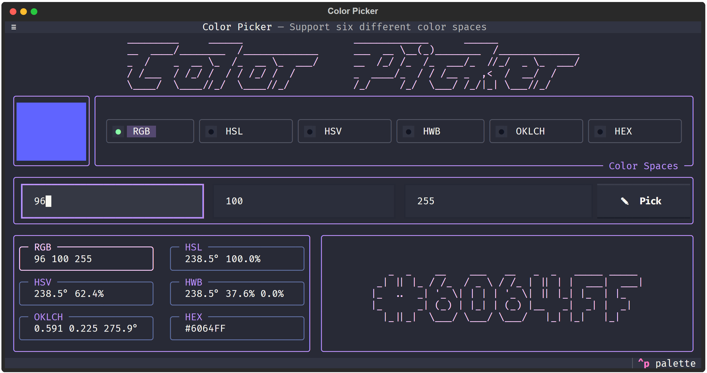

<p align="center">
    
</p>

# Color Picker

**Color Picker** is a Python `TUI` (Text User Interface) application. Key features include **conversions between color spaces** and an **actual global color picker**.

> [!NOTE] 
> The reason why I built this is my love for working in the **command prompt**. 
> Once I discovered that something like a `TUI` exists, I had to try building one myself.

> [!WARNING]
> **Important Note for Linux Users:**
> If you are running this application on Linux, please make sure you are using the **X11 (Xorg)** display server. To use the global color picker, you need to log into an X11/Xorg session instead of Wayland. The application uses the `pynput` library to track mouse movement and clicks globally (even outside the terminal), which Wayland blocks for security reasons.

## Table of Contents
- [Features](#features)
  - [Available Color Spaces](#available-color-spaces)
- [Installation](#installation)
- [Running the App](#running-the-app)
- [Possible Future Features](#possible-future-features)

## Features

- Color Conversions
- Global Eyedropper
- Built-in `textual` features (Themes, keyboard shortcuts, console, etc.)

### Available Color Spaces

<table border="1">
    <tr>
        <th>Color Space</th>
        <th>Channels</th>
        <th>Range</th>
        <th>Description</th>
    </tr>
    <tr>
        <td rowspan="3" align="center">RGB</td>
        <td>R</td>
        <td>0 - 255</td>
        <td>Red</td>
    </tr>
    <tr>
        <td>G</td>
        <td>0 - 255</td>
        <td>Green</td>
    </tr>
    <tr>
        <td>B</td>
        <td>0 - 255</td>
        <td>Blue</td>
    </tr>
    <tr>
        <td rowspan="3" align="center">HSL</td>
        <td>H</td>
        <td>0° - 360°</td>
        <td>Hue</td>
    </tr>
    <tr>
        <td>S</td>
        <td>0% - 100%</td>
        <td>Saturation</td>
    </tr>
    <tr>
        <td>L</td>
        <td>0% - 100%</td>
        <td>Lightness</td>
    </tr>
    <tr>
        <td rowspan="3" align="center">HSV</td>
        <td>H</td>
        <td>0° - 360°</td>
        <td>Hue</td>
    </tr>
    <tr>
        <td>S</td>
        <td>0% - 100%</td>
        <td>Saturation</td>
    </tr>
    <tr>
        <td>V</td>
        <td>0% - 100%</td>
        <td>Value</td>
    </tr>
    <tr>
        <td rowspan="3" align="center">HWB</td>
        <td>H</td>
        <td>0° - 360°</td>
        <td>Hue</td>
    </tr>
    <tr>
        <td>W</td>
        <td>0% - 100%</td>
        <td>Whiteness</td>
    </tr>
    <tr>
        <td>B</td>
        <td>0% - 100%</td>
        <td>Blackness</td>
    </tr>
    <tr>
        <td rowspan="3" align="center">OKLCH</td>
        <td>L</td>
        <td>0 - 1</td>
        <td>Lightness</td>
    </tr>
    <tr>
        <td>C</td>
        <td>0 - 0.4</td>
        <td>Chroma</td>
    </tr>
    <tr>
        <td>H</td>
        <td>0° - 360°</td>
        <td>Hue</td>
    </tr>
    <tr>
        <td align="center">HEX</td>
        <td>HEX</td>
        <td>000000 - FFFFFF</td>
        <td>Hexadecimal</td>
    </tr>
</table>

## Installation

First, clone the repository and navigate to the project folder:

```bash
git clone https://github.com/bag1s3k/color_picker.git
cd color_picker
```

## Running the app

This project uses [uv](https://github.com/astral-sh/uv) package manager for dependency management and running the application. To make running commands from the terminal as easy as possible, there is also a `justfile` included (this requires the [just](https://github.com/casey/just) tool).

### Adding dependencies

- `uv sync` - If you use `uv`
- `pip install .` - If you wanna use `pip`

### Running with `just + uv` (Recommended)

If you have `just` and `uv` installed, this is the fastest and easiest way:

- `just run` – Standard run of the app.
- `just dev` – Runs the app in development mode (supports live-reload when you change the `CSS` code and sends events to the console).
- `just console` – Opens a separate window with the Textual console to monitor logs and `print` outputs in the background.

> [!TIP]
> Development tip: Open one terminal with `just console` and \
> then run `just dev` in a second terminal.

### Alternative: Running with `uv`

If you don't use `just`, you can use equivalent commands directly through `uv`:

- `uv run -m src.color_picker` – Standard run of the app.
- `uv run textual run --dev .\src\color_picker\__main__.py` – Runs the app in development mode.
- `uv run textual console` – Opens the Textual developer console.
- `uv run textual serve .\src\color_picker\__main__.py` - Runs the app on localhost e.g. `http://localhost:8000`

### Alternative: Running with standard Python

If you prefer to use standard Python commands inside your activated virtual environment (`.venv`), you can use:

1. Activate python virtual environment
    - `.\.venv\Scripts\activate` - on Windows
    - `source ./bin/activate` - on Linux/macOS

- `python -m src.color_picker` – Standard run of the app.
- `textual run --dev src/color_picker/__main__.py` – Runs the app in development mode (requires `textual` installed globally or in your environment).
- `textual console` – Opens the Textual developer console.

## Possible future features

- Responsive layout
- Copy buttons
- Shortcuts
- Config file (default settings, history, etc.)